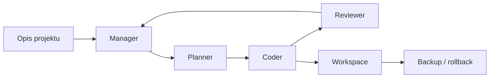

# CodeFabric

Prototyp aplikacji wspierającej tworzenie projektów programistycznych z pomocą generatywnej AI.

Projekt powstał jako eksperyment z automatyzacją pracy programistycznej: użytkownik opisuje pomysł na aplikację, a system pomaga przejść od wymagań do planu, struktury plików i wygenerowanego kodu.

## Co Pokazuje Projekt

- pracę z aplikacją webową w Streamlit,
- podział procesu na role: manager, planner, coder i reviewer,
- wykorzystanie LangGraph do prowadzenia przepływu między agentami,
- integrację z lokalnymi modelami przez Ollama i LangChain,
- zapisywanie wygenerowanych plików w osobnym workspace,
- mechanizm backupu i rollbacku dla zmian w projekcie,
- podstawy pracy z kontekstem, plikami i oceną wygenerowanego kodu.

## Jak Działa



## Główne Elementy

- `app.py` - interfejs użytkownika w Streamlit.
- `graph/workflow.py` - przepływ agentów zbudowany w LangGraph.
- `agents/manager.py` - decyduje o następnym kroku procesu.
- `agents/planner.py` - przygotowuje plan realizacji.
- `agents/coder.py` - generuje lub modyfikuje pliki.
- `agents/reviewer.py` - sprawdza wynik i sugeruje poprawki.
- `tools/file_ops.py` - operacje na plikach, workspace i backupach.
- `tools/llm_factory.py` - konfiguracja lokalnych modeli LLM.

## Technologie

- Python
- Streamlit
- LangChain
- LangGraph
- Ollama
- ChromaDB
- Pydantic
- python-dotenv

## Uruchomienie Lokalnie

Projekt wymaga lokalnie dostępnego środowiska Python oraz skonfigurowanego Ollama.

```bash
python -m venv .venv
source .venv/bin/activate
pip install -r requirements.txt
streamlit run app.py
```

Na Windows:

```powershell
python -m venv .venv
.venv\Scripts\Activate.ps1
pip install -r requirements.txt
streamlit run app.py
```

## Konfiguracja

Opcjonalne zmienne środowiskowe można ustawić w pliku `.env`:

```env
OLLAMA_BASE_URL=http://localhost:11434
OLLAMA_TOKEN=
VERIFY_SSL=False
```

Modele dostępne w interfejsie są skonfigurowane w `app.py`.

## Status Projektu

To prototyp edukacyjno-portfolio, a nie gotowy produkt komercyjny. Najważniejszym celem projektu jest pokazanie podejścia do automatyzacji z pomocą AI, pracy z agentami oraz budowania narzędzi wspierających programistę.

## Ograniczenia

- aplikacja wymaga lokalnej konfiguracji modeli,
- jakość wyniku zależy od wybranego modelu i opisu użytkownika,
- wygenerowany kod powinien zostać sprawdzony przez człowieka,
- projekt nie powinien być traktowany jako zamiennik normalnego procesu review i testowania.
