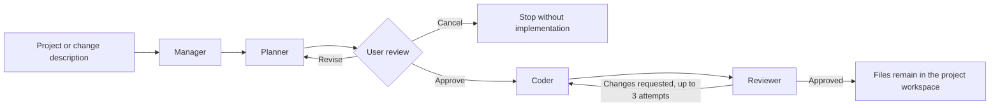

# CodeFabric

CodeFabric is a completed solo portfolio prototype for AI-assisted software
project generation. A user describes a new application or a requested change;
CodeFabric prepares a plan, pauses for approval or revision, generates or edits
project files, and performs an LLM-based review against the approved plan.

The application uses locally or privately hosted [Ollama](https://ollama.com/)
models at runtime. It does not connect to OpenAI Codex and does not use Codex as
a model provider.

I originally developed CodeFabric during a 150-hour Vocational Software
Development Internship at the Office of the Polish Financial Supervision
Authority (UKNF) in Warsaw, from 3 November to 3 December 2025. I continued
refining it independently after the internship.

> **Internship-project disclaimer:** CodeFabric was developed as an individual
> internship project and was not an official product or production system of
> the Office of the Polish Financial Supervision Authority.

## What the prototype demonstrates

- A Streamlit interface for describing a new application or a change to an
  existing project.
- Planner, coder, reviewer, and manager roles coordinated through a LangGraph
  workflow.
- A human checkpoint before implementation: the user can approve the plan,
  request revisions, or cancel without changing project files.
- Project-file generation and targeted edits using Ollama models selected in
  the interface.
- An LLM-based review loop that inspects text files against the approved plan
  and allows up to three correction attempts.
- Separate persistent workspaces and saved conversation history for each
  project.
- File preview, backups, rollback, and ZIP export.

The current application interface is in Polish. Generated code is not executed
automatically and must be inspected, run, and tested by a person before use.
The LLM review is a consistency check, not a correctness guarantee or a
replacement for human testing.

## Workflow



| Component | Responsibility |
| --- | --- |
| `app.py` | Streamlit interface, project sessions, approval controls, and file tools |
| `graph/workflow.py` | LangGraph nodes and routing |
| `agents/planner.py` | Prepares a file-level implementation plan |
| `agents/coder.py` | Creates or edits supported text files after approval |
| `agents/reviewer.py` | Uses an LLM to compare generated files with the approved plan |
| `agents/manager.py` | Controls deterministic routing and the correction limit |
| `tools/llm_factory.py` | Configures access to local or private Ollama instances |
| `tools/chat_store.py` | Persists project history, workspaces, backups, and ZIP exports |

## Technologies

- Python
- Streamlit
- LangGraph
- LangChain Core and LangChain Ollama
- Ollama
- pytest
- Ruff
- GitHub Actions

## Requirements

- Python 3.10 or newer
- An [Ollama installation](https://ollama.com/download), either on the same
  computer or on a private server reachable from it
- At least one Ollama model available to the application

Larger models may require substantial RAM or VRAM. The default configuration
uses `qwen2.5-coder:7b`, but the interface can use other models reported by the
configured Ollama instance.

## Setup

### 1. Start Ollama and download a model

Install and start Ollama, then download the default model:

```bash
ollama pull qwen2.5-coder:7b
```

On macOS, Ollama can also be installed and started with Homebrew:

```bash
brew install ollama
brew services start ollama
ollama pull qwen2.5-coder:7b
```

### 2. Run CodeFabric on macOS or Linux

```bash
git clone https://github.com/JakubLewosz/CodeFabric.git
cd CodeFabric
python3 -m venv .venv
source .venv/bin/activate
python -m pip install --upgrade pip
python -m pip install -r requirements.txt
cp .env.example .env
python -m streamlit run app.py
```

### 3. Run CodeFabric on Windows PowerShell

```powershell
git clone https://github.com/JakubLewosz/CodeFabric.git
cd CodeFabric
py -3 -m venv .venv
.venv\Scripts\Activate.ps1
python -m pip install --upgrade pip
python -m pip install -r requirements.txt
Copy-Item .env.example .env
python -m streamlit run app.py
```

As an alternative on Windows, run `run.bat`. The script checks the Python
version, creates `.venv`, installs the dependencies, and starts the application.

After startup, open <http://localhost:8501>.

## Configuration

CodeFabric reads its settings from `.env`. Copy `.env.example` and adjust only
the values needed for your Ollama instance:

```dotenv
OLLAMA_BASE_URL=http://localhost:11434
OLLAMA_TOKEN=
VERIFY_SSL=true
CODEFABRIC_DATA_DIR=./chats
CODEFABRIC_MODELS=qwen2.5-coder:7b
MODEL_CODER=qwen2.5-coder:7b
OLLAMA_TIMEOUT=120
```

| Variable | Purpose |
| --- | --- |
| `OLLAMA_BASE_URL` | URL of the local or private Ollama server |
| `OLLAMA_TOKEN` | Optional bearer token; keep it out of version control |
| `VERIFY_SSL` | TLS certificate verification; disable only for a trusted server with a self-signed certificate |
| `CODEFABRIC_DATA_DIR` | Local directory for project history, workspaces, and backups |
| `CODEFABRIC_MODELS` | Fallback model list when the server does not return one |
| `MODEL_CODER` | Model used only by the diagnostic script |
| `OLLAMA_TIMEOUT` | Request timeout used by the agents and diagnostic script |

The default `./chats` data directory is ignored by Git. If you choose another
path inside the repository, add it to `.gitignore`, or store the data outside
the repository.

To test the Ollama connection independently of Streamlit, run:

```bash
python debug_raw.py
```

This diagnostic makes a real model request. The repository's regular tests do
not require a running Ollama instance.

## Verification and quality tooling

Install the development dependencies and run the repository checks:

```bash
python -m pip install -r requirements-dev.txt
bash scripts/check.sh
```

The script compiles the Python modules, checks formatting and lint rules with
Ruff, and runs the repository's pytest suite. GitHub Actions is configured to
run the same script on Python 3.10 and 3.12 on Ubuntu and on Python 3.12 on
Windows. These checks cover CodeFabric itself; they do not execute or fully
test applications generated by CodeFabric.

## Data handling and boundaries

- `.env`, saved conversations, backups, and generated project files are
  excluded from version control by the repository configuration.
- An optional token is sent only to the configured Ollama server.
- CodeFabric writes supported text files inside the selected project workspace.
- It does not automatically install generated dependencies or run generated
  applications.
- Review generated source code and dependencies before running them.

## Prototype limitations

- Output quality depends on the selected model, its context window, and the
  clarity of the request.
- Larger projects can exceed the bounded context made available to a model.
- The reviewer performs an LLM-based inspection; it does not prove that the
  generated program is correct, secure, or production-ready.
- CodeFabric is not a multi-user service or an execution sandbox for untrusted
  code.
- This is a completed portfolio prototype and is not currently under active
  development.

## Development process

CodeFabric was developed using an AI-assisted workflow, with OpenAI Codex
supporting planning, implementation, debugging, and review. I remained
responsible for defining requirements, inspecting changes, running the
application, testing its behaviour, and correcting issues. Codex was a
development tool; the CodeFabric runtime uses Ollama.
