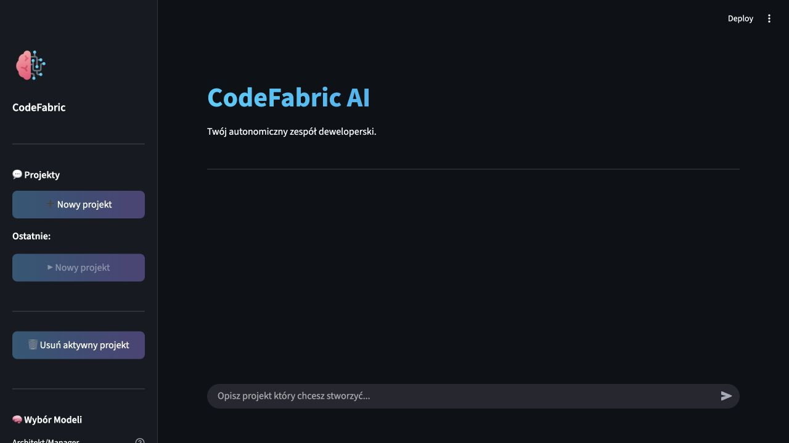
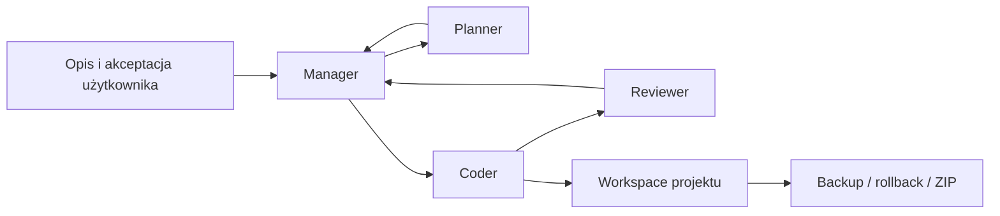

# CodeFabric

[](https://github.com/JakubLewosz/CodeFabric/actions/workflows/ci.yml)

CodeFabric to edukacyjny prototyp aplikacji, która prowadzi opis pomysłu przez
planowanie, generowanie kodu i automatyczny przegląd. Interfejs powstał w
Streamlit, przepływ ról koordynuje LangGraph, a modele działają lokalnie lub
na prywatnym serwerze przez API Ollama.

> Projekt ma charakter portfolio i demonstratora technologii. Kod wygenerowany
> przez model zawsze wymaga weryfikacji przed użyciem produkcyjnym.



## Najważniejsze możliwości

- osobne role managera, planisty, programisty i recenzenta,
- akceptacja planu przez użytkownika przed rozpoczęciem generowania,
- iteracyjna pętla poprawek po recenzji,
- osobny workspace i historia rozmowy dla każdego projektu,
- podgląd plików, kopie zapasowe, rollback i eksport ZIP,
- konfiguracja lokalnego lub zdalnego serwera Ollama,
- testy smoke niewymagające uruchomionego modelu.

## Architektura



| Element | Odpowiedzialność |
| --- | --- |
| `app.py` | interfejs Streamlit, sesje projektów i obsługa plików |
| `graph/workflow.py` | definicja grafu i przejść między rolami |
| `agents/` | planowanie, generowanie i recenzja kodu |
| `tools/llm_factory.py` | wspólna konfiguracja klienta Ollama |
| `tools/file_ops.py` | bezpieczne operacje na workspace |
| `chats/` | lokalne, ignorowane przez Git dane projektów i backupy |

## Wymagania

- Python 3.10 lub nowszy (CI sprawdza 3.10 i 3.12 na Ubuntu oraz 3.12 na Windows),
- działająca instancja [Ollama](https://ollama.com/) dostępna z komputera,
- co najmniej jeden model zgodny z wyborem w panelu aplikacji.

Dla dużych modeli potrzebna jest odpowiednia ilość RAM/VRAM. Można
zacząć od modelu już dostępnego w lokalnej instancji Ollama i wybrać go w
panelu bocznym.

## Szybki start

CodeFabric nie wymaga serwera w chmurze. Ollama działa jako lokalny proces na
Twoim komputerze, domyślnie pod adresem `http://localhost:11434`.

### 1. Uruchom lokalny model

Zainstaluj [Ollamę](https://ollama.com/download), uruchom aplikację, a następnie
pobierz domyślny model:

```bash
ollama pull qwen2.5-coder:7b
```

Na macOS można również wykonać całą instalację przez Homebrew:

```bash
brew install ollama
brew services start ollama
ollama pull qwen2.5-coder:7b
```

Model jest pobierany jednorazowo i później działa lokalnie. Możesz użyć innego
modelu zainstalowanego w Ollamie i wybrać go w panelu bocznym CodeFabric.

### 2. Uruchom CodeFabric

#### macOS i Linux

```bash
git clone https://github.com/JakubLewosz/CodeFabric.git
cd CodeFabric
python3 -m venv .venv
source .venv/bin/activate
python -m pip install --upgrade pip
python -m pip install -r requirements.txt
cp .env.example .env
python -m streamlit run app.py
```

#### Windows (PowerShell)

```powershell
git clone https://github.com/JakubLewosz/CodeFabric.git
cd CodeFabric
py -3 -m venv .venv
.venv\Scripts\Activate.ps1
python -m pip install --upgrade pip
python -m pip install -r requirements.txt
Copy-Item .env.example .env
python -m streamlit run app.py
```

Alternatywnie na Windows można uruchomić `run.bat`; skrypt sprawdzi wersję
Pythona, utworzy `.venv`, zainstaluje zależności i wystartuje aplikację.
Po uruchomieniu otwórz `http://localhost:8501` w przeglądarce.

## Konfiguracja

Ustawienia są odczytywane z `.env`. Plik `.env.example` zawiera bezpieczne
wartości początkowe:

```dotenv
OLLAMA_BASE_URL=http://localhost:11434
OLLAMA_TOKEN=
VERIFY_SSL=true
CODEFABRIC_DATA_DIR=./chats
CODEFABRIC_MODELS=qwen2.5-coder:7b
MODEL_CODER=qwen2.5-coder:7b
OLLAMA_TIMEOUT=120
```

- `OLLAMA_TOKEN` jest opcjonalny i nie powinien trafić do repozytorium.
- `VERIFY_SSL=false` jest przeznaczone wyłącznie dla zaufanych serwerów z
  certyfikatem self-signed.
- `CODEFABRIC_DATA_DIR` wskazuje lokalny katalog rozmów, workspace'ów i
  backupów; domyślne `./chats` jest ignorowane przez Git. Dla innej ścieżki
  wewnątrz repozytorium dodaj ją do `.gitignore` albo wybierz katalog poza
  repozytorium. `CODEFABRIC_MODELS` jest listą zapasową, gdy serwer nie zwróci
  listy modeli.
- `OLLAMA_TIMEOUT` obowiązuje agentów i narzędzie diagnostyczne.
- `MODEL_CODER` dotyczy wyłącznie diagnostyki; modele aplikacji wykrywane są
  automatycznie i wybierane w interfejsie.

Połączenie z Ollamą można sprawdzić niezależnie od Streamlit:

```bash
python debug_raw.py
```

To polecenie wykonuje prawdziwe zapytanie do modelu. Zwykłe testy projektu nie
łączą się z Ollamą.

## Testy i jakość

```bash
python -m pip install -r requirements-dev.txt
bash scripts/check.sh
```

Skrypt wykonuje kompilację wszystkich modułów, kontrolę formatowania, lint oraz
testy grafu, operacji plikowych i interfejsu. Te same kontrole uruchamia GitHub
Actions dla Pythona 3.10 i 3.12 na Ubuntu oraz 3.12 na Windows.

## Dane i bezpieczeństwo

- `.env`, rozmowy, backupy i wygenerowane pliki są ignorowane przez Git,
- token jest przekazywany wyłącznie jako nagłówek do skonfigurowanego serwera,
- przed otwarciem wygenerowanego projektu należy przejrzeć jego kod i
  zależności,
- CodeFabric nie uruchamia wygenerowanego kodu automatycznie.

## Ograniczenia prototypu

- jakość wyniku zależy od modelu, okna kontekstowego i precyzji opisu,
- długie generowanie może wymagać wydajnego serwera Ollama,
- automatyczna recenzja nie zastępuje testów i przeglądu człowieka,
- projekt nie jest usługą wieloużytkownikową ani gotowym sandboxem dla
  niezaufanego kodu.
